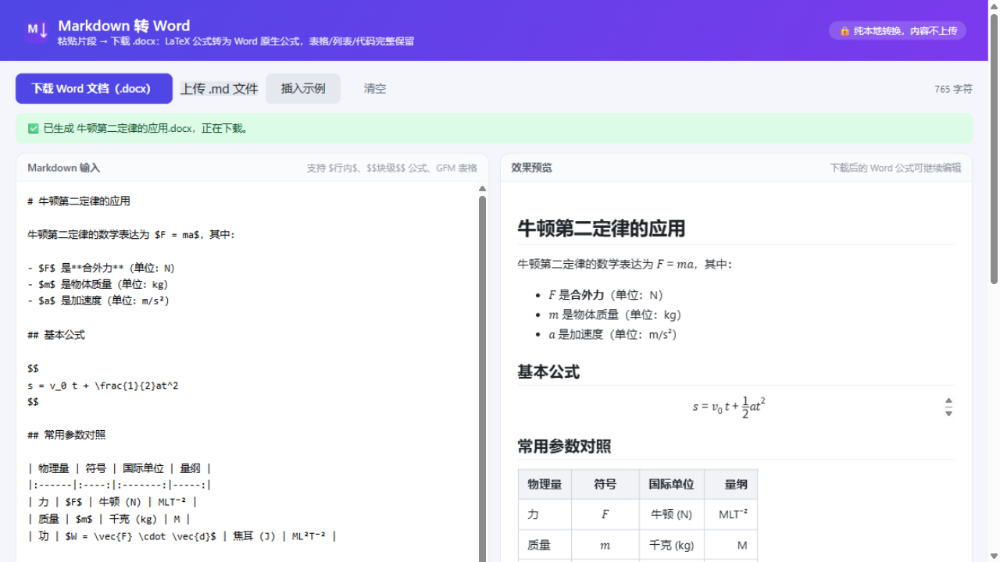

# Markdown2Word

**粘贴 Markdown 片段 → 得到 .docx**：LaTeX 公式转为 **Word 原生公式（可继续编辑）**，表格、列表、代码块、图片、超链接完整保留。

纯本地转换（浏览器/Electron 内完成），**内容不上传到任何服务器**，完全离线可用。



## 下载

| 形态 | 获取方式 |
|------|----------|
| **Windows 桌面版**（推荐） | [Releases](../../releases/latest) 下载 `Markdown2Word Setup x.x.x.exe` → 双击安装 → 开始菜单/桌面快捷方式即用；关闭窗口只是缩到右下角托盘，托盘左键唤起、右键退出 |
| **网页版** | [在线使用](https://bugdefender404.github.io/markdown2word/)，或下载源码后双击 `index.html` |

## 为什么做这个

从 ChatGPT / Claude / Kimi / DeepSeek 复制回答粘贴到 Word，公式变图片或乱码、表格散架。pandoc 能转但只适合整篇文档。现有方案的空白点：**免费的、针对片段的、公式转原生 OMML 的**转换工具——本项目补上。

## 支持的语法

| 类别 | 说明 |
|------|------|
| 公式 | 行内 `$…$` / `\(…\)`，块级 `$$…$$` / `\[…\]`；分数、求和积分、矩阵、`aligned`/`align`/`cases` 环境、`\text{}` 中文——全部转为 Word 原生 OMML |
| 表格 | GFM 表格：表头加粗+底纹、跨页重复表头、列对齐，单元格内公式与 `<br>` |
| 结构 | 标题（映射 Word 内置"标题 1-6"，导航窗格可用）、有序/无序列表（含嵌套）、引用块、分隔线 |
| 行内 | 粗体、斜体、删除线、行内代码（Consolas+底纹）、上下标、`<br>`/`<sub>` 等少量 HTML |
| 附件 | `data:` 图片内嵌 docx；网络图片尽力抓取（受 CORS 限制，抓不到降级为链接）；超链接为真实可点击链接 |
| 容错 | 单个公式转换失败时保留原文并提示，不影响其他内容 |

已知限制：无 `align` 环境的 `$$` 块内 `\\` 分行会拆成多个独立公式段落；列表编号为静态文本；代码块无语法高亮。

## 技术原理

```
Markdown（markdown-it + 自研 $…$ 定界符规则，防货币符号误判、代码块保护）
  → LaTeX 转 MathML（temml）
  → MathML 转 OMML（mathml2omml，Word 原生公式）
  → 组装 WordprocessingML + 内置样式（跟随 Word 主题）
  → JSZip 打包 .docx（图片进 word/media/，超链接为外部关系）
```

- **网页版**：纯静态页面，转换库全部打包在 `vendor/`，双击 `index.html` 离线可用
- **桌面版**：Electron 封装同一页面（`electron-main.js`），额外提供独立窗口、托盘常驻（点 X 缩到托盘，左键唤起/隐藏，右键退出；再次双击快捷方式唤起已开窗口）、外链交系统浏览器、docx"另存为"对话框

## 开发

```bash
npm install    # 安装依赖（国内可加 --registry=https://registry.npmmirror.com）
npm test       # 33 项无头测试：各元素 OOXML 正确性 + XML 合法性 + docx 打包结构
npm run electron:dev       # 以 Electron 窗口调试
npm run electron:build     # 构建 Windows 安装包（输出到 release/）
node tools/build-sample-docx.js            # 用 samples/ai-sample.md 生成示例 docx
node tools/serve.js 8642                   # 本地服务器预览
powershell -File tools/word-open-check.ps1 # 用本机 Word 打开示例 docx 验证
```

Electron 构建需设置国内镜像：

```bash
export ELECTRON_MIRROR=https://npmmirror.com/mirrors/electron/
export ELECTRON_BUILDER_BINARIES_MIRROR=https://npmmirror.com/mirrors/electron-builder-binaries/
npm run electron:build
```

## 目录结构

```
index.html               网页版入口（双击即用）
electron-main.js         Electron 主进程
src/converter/m2w-core.js   核心转换管线（浏览器/Node 通用，无构建依赖）
src/docx-builder.js      docx 打包（JSZip；内嵌图片/外部超链接）
src/app.js               网页交互与实时预览
vendor/                  本地打包的转换库（markdown-it / temml / mathml2omml / jszip）
test/run-tests.js        无头测试
samples/                 测试样例与生成的示例 docx
tools/                   构建/验证辅助脚本
buildRes/                打包资源（应用图标）
```

## 许可证

MIT（见 [LICENSE](LICENSE)）。`vendor/` 内第三方库声明见 [NOTICE.md](NOTICE.md)。
